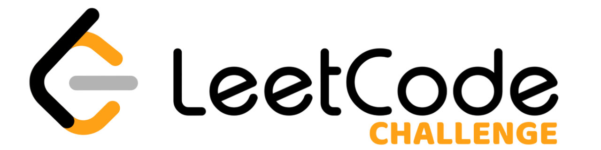

# LeetCode Challenge

<p align="center">
  
</p>

## Sobre o LeetCode

[LeetCode](https://leetcode.com) é uma plataforma premium para praticar problemas de programação e se preparar para entrevistas técnicas. Ela oferece uma vasta coleção de problemas que ajudam desenvolvedores a aprimorar suas habilidades algorítmicas.

## Visão Geral do Projeto

Este repositório é um esforço colaborativo de [@patrickRDuck](https://github.com/patrickRDuck) and [@enzobalogh](https://github.com/enzobalogh). Nosso objetivo é resolver um problema do LeetCode por dia, documentando nossas soluções e explicações para promover o aprendizado e crescimento.

## Resumo

Aqui você encontrará o resumo de todos os problemas que resolvemos. Cada problema é documentado com sua descrição, solução e explicação.

Para ver o resumo completo de todos os exercícios, basta acessar o [`summary.md`](problems/summary.md).

Se você deseja filtrar problemas por dificuldade, você pode verificar os seguintes arquivos:

- **Problemas Fáceis**: [`easy.md`](problems/easy.md)
- **Problemas Médios**: [`medium.md`](problems/medium.md)
- **Probelmas Difícies**: [`hard.md`](problems/hard.md)

## Estrutura do Repositório

Cada problema é organizado em seu próprio diretório, contendo:

- **descricao.md**: O enunciado do problema.
- **explicacao.md**: Uma explicação detalhada da abordagem e lógica utilizada.
- **solucao.ts**: A solução implementada em Typescript.
- **solucao.xx**: A solução implementada em **qualquer outra linguagem**.

## Suporte Multilíngue

Para atender a um público mais amplo, fornecemos documentação em inglês e português. A estrutura para cada problema é a seguinte:

```
├── problems
│   └── solutions
│       ├── 001-two-sum
│       │   ├── en/
│       │   │   ├── description.md
│       │   │   └── explanation.md
│       │   ├── pt/
│       │   │   ├── descricao.md
│       │   │   └── explicacao.md
│       │   ├── solution.py
│       │   └── solution.xx
```

## Contato

Conecte-se conosco no **Linkedin**: [Patrick Duarte](https://www.linkedin.com/in/patrick-duarte-2b0734202/), [Enzo Balogh](https://www.linkedin.com/in/enzo-braga-balogh-676105302/).


_Para mostrar apoio, dê uma ⭐ estrela a este repositório! Significa muito, obrigado.